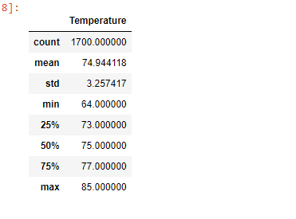
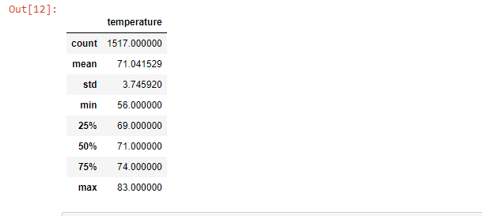

# surfs_up
## Overview

W. Avy likes your analysis, but he wants more information about temperature trends before opening the surf shop. Specifically, he wants temperature data for the months of June and December in Oahu, in order to determine if the surf and ice cream shop business is sustainable year-round. W. Avy wants us to use analytics on a weather dataset he has from the the island where we want to open the shop.

## Results:
* the average temperature in June is 74.9 Degrees and in December it is 71.05 meaning that seasonality is not a factor in this area of the world, it is safe to say that it would be ideal to open the shop all year long.
* The lower quartile is 73 and upper quartile is 77 in June, meaning that the weather does not change much during the years.
* The lower quartile is 69 and upper quartile is 74 in December, meaning that the weather does not change much during the years.

 

## Summary:
W.avy  wanted us to use the data to analyze the weather in Hawaii and decide if seasonality is a factor in order to open the shop. We can see that the temperature is not a factor in this case. i would suggest to run 2 other queries that can show the precipitation during both months, rain would affect the activity in the shop, so it would be ideal to find out how much rain there is during those two months.

